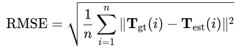
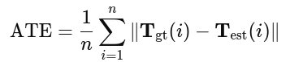
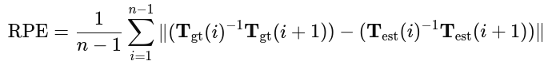

# Loc_Dataset
本数据集v0.1用于A2RL定位测试。 
本数据包含3类7种不同场景，总时长超过50分钟，激光雷达帧数超过3万个，按照速度和道路类型划分不同场景。 
提供RTK-GNSS/INS传感器原始数据及人为滤波后的数据，包括GNSS信息、OSS信息、轮速信息、激光雷达原始点云信息等。

## 下载链接 Download
百度云盘：https://pan.baidu.com/s/1VMbNRptQ9a71B8n04lAcAQ?pwd=khyn 密码：khyn 

## 场景划分 Scene type
| Scene | Time | Velocity | LiDAR |
|:-----------|------------:|:------------:|------------:|
| slow_long_0    | 200s     | 7m/s<     | 2000     |
| slow_long_1    | 200s     | 7m/s<     | 2000     |
| slow_curve_0    | 280s     | 7m/s<     | 2800     |
| slow_curve_1    | 150s     | 7m/s<     | 1400     |
| slow_long_curve_0    | 480s     | 7m/s<     | 4800     |
| high_long_0    | 50s     | 7m/s~20ms     | 520     |
| high_long_1    | 70s     | 7m/s~20ms     | 700     |
| high_curve_0    | 260s     | 7m/s~20ms     | 2600     |
| high_long_curve_0    | 260s     | 7m/s~20ms     | 2600     |
| high_long_curve_1    | 230s     | 7m/s~20ms     | 2240     |
| high_long_curve_2    | 300s     | 7m/s~20ms     | 3000     |
| high_long_curve_3    | 280s     | 7m/s~20ms     | 2800     |
| pit_lane_0   | 120s     | 7m/s<     | 1160     |
| pit_lane_1   | 140s     | 7m/s<     | 1400     |

## 文件结构 File Sructure

## 测试基线 Test baseline
位置信息：/a2rl/observer/ego_loc，ENU坐标系 
速度信息：/a2rl/vn/ins(秒速)或/a2rl/eav24_bsu/kistler_correvit(时速)，车体坐标系 
航向信息：/a2rl/observer/ego_state，ENU坐标系 

RMSE: Mean Squared Error，均方根误差，评估估计位置与真实位置之间的误差 

ATE: Absolute Trajectory Error，绝对轨迹误差，评估估计轨迹与真实轨迹的全局一致性 

RPE： Relative Pose Error，相对位姿误差，评估邻帧之间的相对位姿误差 

Max Error: 衡量的是轨迹中位置误差的最大值，即在整个轨迹中的最大绝对误差。 

How to test baseline? 
pip install evo 
evo_ate GT_file Estimate_file -p 
evo_rpe GT_file Estimate_file -p 
rmse = np.sqrt(np.mean(np.array(ate_errors)**2))

| Algrithm | ATE | MAX ERORR | RPE Mean | RMSE |
|:-----------|------------:|:------------:|------------:|------------:|
| FASTLIO    | 8.6817     | 21.719       | 11.3849     |       |

FASTLIO
| Scene | ATE | MAX ERORR | RPE Mean | RMSE |
|:-----------|------------:|:------------:|------------:|------------:|
| high_curve_0    | 8.96     | 16.529       | 8.029     |       |
| high_long_0    | 14.123     | 20.354     | 29.215     |       |
| high_long_1    | 2.853     | 7.432     | 5.446     |       |
| high_long_curve_0      | 5.883     | 19.068     | 7.462     |       |
| high_long_curve_1      | 14.832     | 38.845     | 15.54     |       |
| high_long_curve_2      | 10.75     | 34.857     | 11.994     |       |
| slow_curve_0      | 5.238     | 25.706     | 6.278     |       |
| slow_curve_1      | 12.422     | 27.115     | 14.582     |       |
| slow_long_0      | 0.479     | 3.695     | 0.501     |       |
| slow_long_1      | 11.277     | 23.859     | 14.586     |       |

## 话题类别 Topic classification
linear velocity:

/a2rl/eav24_bsu/kistler_correvit

/a2rl/eav24_bsu/kistler_vel_angle

/localization/twist_estimator/twist_from_ins

/a2rl/observer/ego_state

/a2rl/vn/ins

/vectornav/raw/ins

angular rate:

/a2rl/eav24_bsu/kistler_vel_angle

/localization/twist_estimator/twist_from_ins

/a2rl/observer/ego_state

/a2rl/vn/ins

/vectornav/raw/ins

wheel velocity:

/a2rl/eav24_bsu/wheels_speed_01

acceleration:

/a2rl/eav24_bsu/kistler_acc_body

/a2rl/eav24_bsu/kistler_angle_vel_body

/a2rl/eav24_bsu/kistler_vel_angle

/a2rl/vn/ins

/vectornav/raw/ins

position:

/a2rl/observer/ego_loc

/vectornav/raw/gps
/vectornav/raw/gps2

/a2rl/vn/ins

imu:

/vectornav/raw/imu

LiDAR:

/sensor/lidar_front/points
/sensor/lidar_left/points
/sensor/lidar_right/points

other:

/vectornav/raw/time

/vectornav/raw/attitude

/a2rl/eav24_bsu/kistler_distance

## 效果演示 Video 

